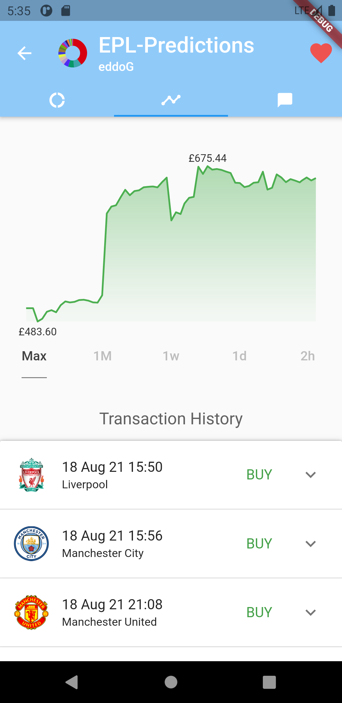
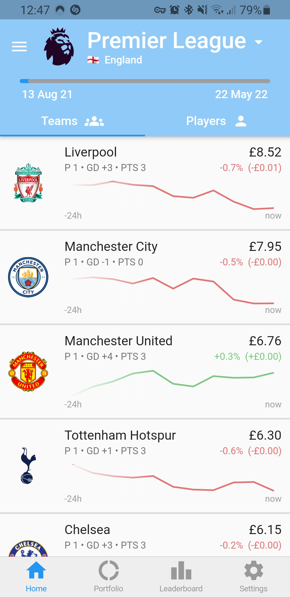
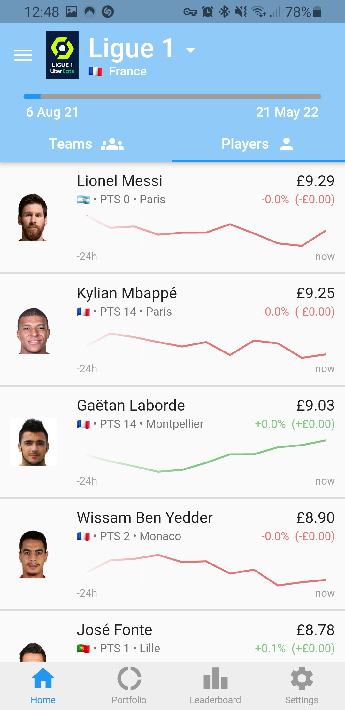
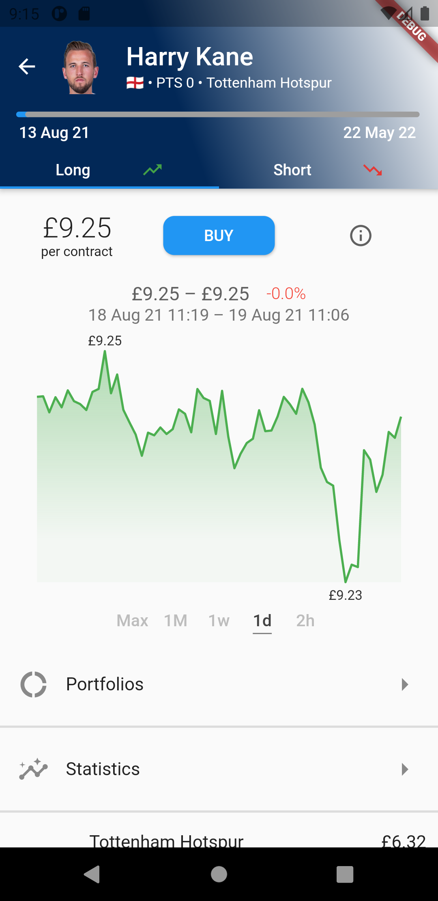
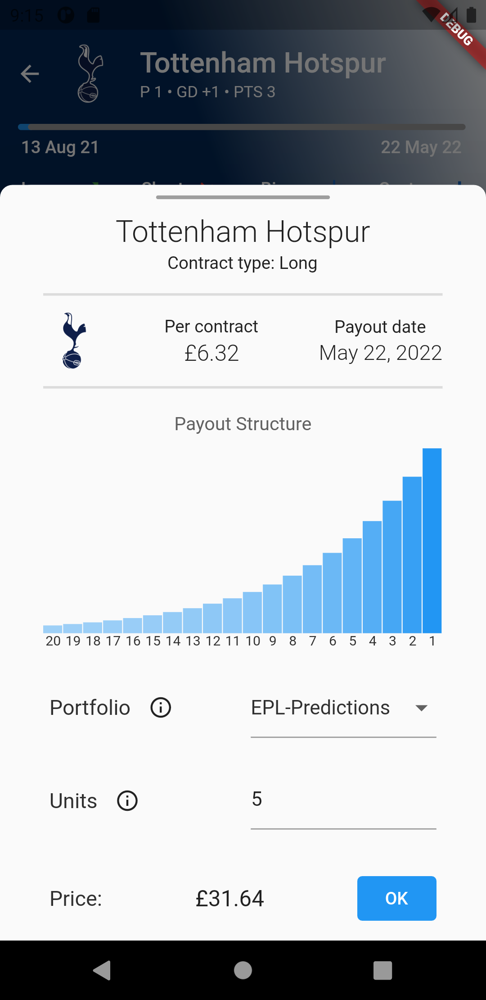

# Sportfolios Mobile

This repository contains the source code for the SportFolios mobile app. It is written in the Dart programming language using the Flutter framework. Please note that this app is no longer functional out of the box, since the databases and servers it relies on are no longer operational. Also note that both the `google-services.json` and the `GoogleService-Info.plist` files are no longer linked to an active Firebase account. 

